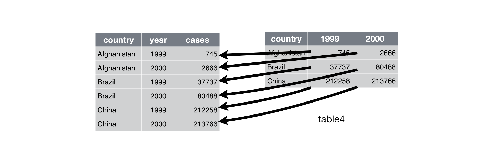

# Tidy Data

```{r, message=FALSE}
library(tidyverse)
```

> "Happy families are all alike; every unhappy family is unhappy in its
> own way." --– Leo Tolstoy

> "Tidy datasets are all alike, but every messy dataset is messy in its
> own way." --– Hadley Wickham

In this chapter, you will learn a consistent way to organize your data in R, an organisation called __tidy data__. Getting your data into this format requires some upfront work, but that work pays off in the long term. Once you have tidy data and the tidy tools provided by packages in the tidyverse, you will spend much less time munging data from one representation to another, allowing you to spend more time on the analytic questions at hand.

This chapter will give you a practical introduction to tidy data and the accompanying tools in the __tidyr__ package. If you'd like to learn more about the underlying theory, you might enjoy the *Tidy Data* paper published in the Journal of Statistical Software, <http://www.jstatsoft.org/v59/i10/paper>.

## Tidy data

There are three interrelated rules which make a dataset tidy:

1.  Each variable must have its own column.
1.  Each observation must have its own row.
1.  Each value must have its own cell.

Figure \@ref(fig:tidy-structure) shows the rules visually.

```{r tidy-structure, echo = FALSE, out.width = "100%", fig.cap = "Following three rules makes a dataset tidy: variables are in columns, observations are in rows, and values are in cells."}
knitr::include_graphics("images/tidy/tidy-1.png")
```

These three rules are interrelated because it's impossible to only satisfy two of the three. 

Why ensure that your data is tidy? There are two main advantages:

1.  There's a general advantage to picking one consistent way of storing
    data. If you have a consistent data structure, it's easier to learn the
    tools that work with it because they have an underlying uniformity.
    
1.  There's a specific advantage to placing variables in columns because
    it allows R's vectorized nature to shine. As you learned in
    [mutate](#mutate-funs) and [summary functions](#summary-funs), most 
    built-in R functions work with vectors of values. That makes transforming 
    tidy data feel particularly natural.

dplyr, ggplot2, and all the other packages in the tidyverse are designed to work with tidy data. 

## Example

You can represent the same underlying data in multiple ways. The example below shows the same data organised in four different ways. Each dataset shows the same values of four variables *country*, *year*, *population*, and *cases*, but each dataset organizes the values in a different way.

```{r}
table1
table2
table3

# Spread across two tibbles
table4a  # cases
table4b  # population
```

These are all representations of the same underlying data, but they are not equally easy to use. One dataset, the tidy dataset, will be much easier to work with inside the tidyverse. 

Which dataset is tidy?  Why aren't the other datasets considered tidy?  

```{block2, type='rmdtip'}
How would you calculate the rate per 10,000 population for each data set? How would you compute the cases per year?  How would you visualize the changes over time?
```

## Spreading and gathering

The principles of tidy data seem so obvious that you might wonder if you'll ever encounter a dataset that isn't tidy. Unfortunately, however, most data that you will encounter will be untidy. There are two main reasons:

1.  Most people aren't familiar with the principles of tidy data, and it's hard
    to derive them yourself unless you spend a _lot_ of time working with data.
    
1.  Data is often organised to facilitate some use other than analysis. For 
    example, data is often organised to make entry as easy as possible.
    
1.  How to efficiently store, analyze, and present data are *usually* three different data formats.
    
This means for most real analyses, you'll need to do some tidying / untidying. The first step is always to figure out what the variables and observations are. Sometimes this is easy; other times it can be a bit more difficult. 
The second step is to resolve one of two common problems:

1. One variable might be spread across multiple columns.

1. One observation might be scattered across multiple rows.

Typically a dataset will only suffer from one of these problems; it'll only suffer from both if you're really unlucky! To fix these problems, you'll need the two most important functions in tidyr: `gather()` and `spread()`.

### Gathering

A common problem is a dataset where some of the column names are not names of variables, but _values_ of a variable. Take `table4a`: the column names `1999` and `2000` represent values of the `year` variable, and each row represents two observations, not one.

```{r}
table4a
```

```{r tidy-gather, echo = FALSE, out.width = "100%", fig.cap = "Gathering `table4` into a tidy form."}

```

To tidy a dataset like this, we need to __gather__ those columns into a new pair of variables. To describe that operation we need three parameters:

* The name of the variable whose values form the column names. This is
  the `key`, and here it is `year`.

* The name of the variable whose values are spread over the cells. That is the 
  `value`, and here it's the number of `cases`.
  
* The set of columns that represent values, not variables. In this example, 
  those are the columns `1999` and `2000`.
  
Together those parameters generate the call to `gather()`:

```{r}
table4a %>% 
  gather(key = "year", value = "cases", `1999`, `2000`)
```

```{block2, type='rmdimportant'}
Note that "1999" and "2000" are non-syntactic names (because they don't start with a letter) so we have to surround them in backticks. To refresh your memory of the other ways to select columns, see [select](#select).
```

In the final result, the gathered columns are dropped, and we get new `key` and `value` columns. Otherwise, the relationships between the original variables are preserved. Visually, this is shown in Figure \@ref(fig:tidy-gather). We can use `gather()` to tidy `table4b` in a similar fashion. The only difference is the variable stored in the cell values.

To combine the tidied versions of `table4a` and `table4b` into a single tibble, we need to use `dplyr::left_join()`, which you'll learn about in [relational data].

```{r}
tidy4a <- table4a %>% 
  gather(key = "year", value = "cases", `1999`, `2000`)
tidy4b <- table4b %>% 
  gather(key = "year", value = "population", `1999`, `2000`)
left_join(tidy4a, tidy4b)
```

### Spreading

Spreading is the opposite of gathering. You use it when an observation is scattered across multiple rows. For example, take `table2`: an observation is a country in a year, but each observation is spread across two rows.

```{r}
table2
```

```{r tidy-spread, echo = FALSE, out.width = "100%", fig.cap = "Spreading `table2` makes it tidy"}
knitr::include_graphics("images/tidy/tidy-8.png")
```

To tidy this up, we first analyse the representation in similar way to `gather()`. This time, however, we only need two parameters:

* The column that contains variable names, the `key` column. Here, it's 
  `type`.

* The column that contains values from multiple variables, the `value`
  column. Here it's `count`.

Once we've figured that out, we can use `spread()`, as shown programmatically below, and visually in Figure \@ref(fig:tidy-spread).

```{r}
table2 %>%
    spread(key = type, value = count)
```

```{block type='rmdnote'}
As you might have guessed from the common `key` and `value` arguments, `spread()` and `gather()` are complements. `gather()` makes wide tables narrower and longer; `spread()` makes long tables shorter and wider.
```

## Separating and uniting

So far you've learned how to tidy `table2` and `table4`, but not `table3`. `table3` has a different problem: we have one column (`rate`) that contains two variables (`cases` and `population`). To fix this problem, we'll need the `separate()` function. You'll also learn about the complement of `separate()`: `unite()`, which you use if a single variable is spread across multiple columns.


### Separate

`separate()` pulls apart one column into multiple columns, by splitting wherever a separator character appears. Take `table3`:

```{r}
table3
```

```{r tidy-separate, echo = FALSE, out.width = "75%", fig.cap = "Separating `table3` makes it tidy"}
knitr::include_graphics("images/tidy/tidy-17.png")
```

The `rate` column contains both `cases` and `population` variables, and we need to split it into two variables. `separate()` takes the name of the column to separate, and the names of the columns to separate into, as shown in Figure \@ref(fig:tidy-separate) and the code below.

```{r}
table3 %>% 
  separate(rate, into = c("cases", "population"))
```

```{block2, type='rmdimportant'}
By default, `separate()` will split values wherever it sees a non-alphanumeric character (i.e. a character that isn't a number or letter). For example, in the code above, `separate()` split the values of `rate` at the forward slash characters. If you wish to use a specific character to separate a column, you can pass the character to the `sep` argument of `separate()`. Formally, `sep` is a regular expression, which we learn more about in [strings].
```

Look carefully at the column types: you'll notice that `cases` and `population` are character columns. This is the default behavior in `separate()`: it leaves the type of the column as is. Here, however, it's not very useful as those really are numbers. We can ask `separate()` to try and convert to better types using `convert = TRUE`:

```{r}
table3 %>% 
  separate(rate, into = c("cases", "population"), convert = TRUE)
```

You can also pass a vector of integers to `sep`. `separate()` will interpret the integers as positions to split at. Positive values start at 1 on the far-left of the strings; negative value start at -1 on the far-right of the strings. When using integers to separate strings, the length of `sep` should be one less than the number of names in `into`. 

You can use this arrangement to separate the last two digits of each year. This make this data less tidy, but is useful in other cases, as you'll see in a little bit.

```{r}
table3 %>% 
  separate(year, into = c("century", "year"), sep = 2)
```

### Unite

`unite()` is the inverse of `separate()`: it combines multiple columns into a single column. You'll need it much less frequently than `separate()`, but it's still a useful tool to have in your back pocket.

```{r tidy-unite, echo = FALSE, out.width = "75%", fig.cap = "Uniting `table5` makes it tidy"}
knitr::include_graphics("images/tidy/tidy-18.png")
```

We can use `unite()` to rejoin the *century* and *year* columns that we created in the last example. That data is saved as `tidyr::table5`. `unite()` takes a data frame, the name of the new variable to create, and a set of columns to combine, again specified in `dplyr::select()` style:

```{r}
table5 %>% 
  unite(new, century, year)
```

In this case we also need to use the `sep` argument. The default will place an underscore (`_`) between the values from different columns. Here we don't want any separator so we use `""`:

```{r}
table5 %>% 
  unite(new, century, year, sep = "")
```

## Missing values

Changing the representation of a dataset brings up an important subtlety of missing values. Surprisingly, a value can be missing in one of two possible ways:

* __Explicitly__, i.e. flagged with `NA`.
* __Implicitly__, i.e. simply not present in the data.

Let's illustrate this idea with a very simple data set:

```{r}
mydata <- tibble(
  year   = c(2015, 2015, 2015, 2015, 2016, 2016, 2016),
  qtr    = c(   1,    2,    3,    4,    2,    3,    4),
  rate   = c(1.88, 0.59, 0.35,   NA, 0.92, 0.17, 2.66)
)

mydata
```

There are two missing values in this dataset:

* The rate for the fourth quarter of 2015 is explicitly missing, because
  the cell where its value should be instead contains `NA`.
  
* The rate for the first quarter of 2016 is implicitly missing, because it
  simply does not appear in the dataset.
  
The way that a dataset is represented can make implicit values explicit. For example, we can make the implicit missing value explicit by putting years in the columns:

```{r}
mydata %>% 
  spread(year, rate)
```

Because these explicit missing values may not be important in other representations of the data, you can set `na.rm = TRUE` in `gather()` to turn explicit missing values implicit:

```{r}
mydata %>% 
  spread(year, rate) %>% 
  gather(year, rate, `2015`:`2016`, na.rm = TRUE)
```

Another important tool for making missing values explicit in tidy data is `complete()`:

```{r}
mydata %>% 
  complete(year, qtr)
```

`complete()` takes a set of columns, and finds all unique combinations. It then ensures the original dataset contains all those values, filling in explicit `NA`s where necessary.

```{block2, type='rmdwarning'}
It is also possible that you have such incomplete data that `complete()` does not have all the data needed for complete cases.  Imagine in the above example if the year 2016 data wat instead complete missing but you had 2017 data.  In this case a different technique would need to be used.  A common solution to this problem is to use `crossing()` to make the compete cases then "join" the data set to the complete cases.
```

There's one other important tool that you should know for working with missing values. Sometimes when a data source has primarily been used for data entry (tables from *Excel*, *pdf*, and *Word*), missing values indicate that the previous value should be carried forward:

```{r}
treatment <- tribble(
  ~ person,           ~ treatment, ~response,
  "Derrick Whitmore", 1,           7,
  NA,                 2,           10,
  NA,                 3,           9,
  "Katherine Burke",  1,           4
)

treatment
```

You can fill in these missing values with `fill()`. It takes a set of columns where you want missing values to be replaced by the most recent non-missing value (sometimes called last observation carried forward).

```{r}
treatment %>% 
  fill(person)
```


## Non-tidy data

Before we continue on to other topics, it's worth talking briefly about non-tidy data. Earlier in the chapter, I used the pejorative term "messy" to refer to non-tidy data. That's an oversimplification: there are lots of useful and well-founded data structures that are not tidy data. There are two main reasons to use other data structures:

* Alternative representations may have substantial performance or space 
  advantages.
  
* Specialized fields have evolved their own conventions for storing data
  that may be quite different to the conventions of  tidy data.

Either of these reasons means you'll need something other than a tibble (or data frame). If your data does fit naturally into a rectangular structure composed of observations and variables, I think tidy data should be your default choice. But there are good reasons to use other structures; tidy data is not the only way.

If you'd like to learn more about non-tidy data, I'd highly recommend this thoughtful blog post by Jeff Leek: <http://simplystatistics.org/2016/02/17/non-tidy-data/>
